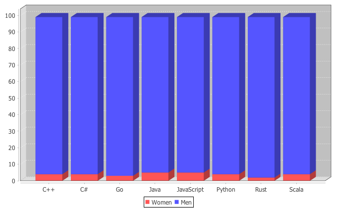

# Data for women in tech
## Based on Stack Overflow Survey data
[Original Data](http://stackoverflow.com/insights/survey)

This is my attempt at an analysis of the situation of women in tech.

## Language Distribution

