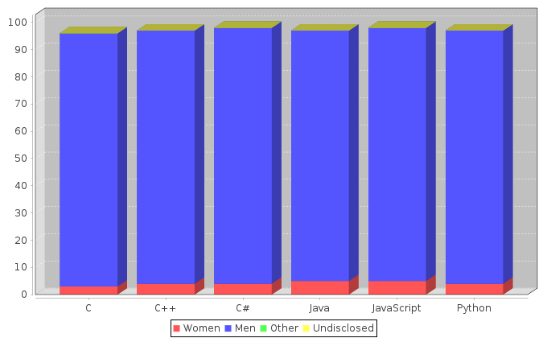
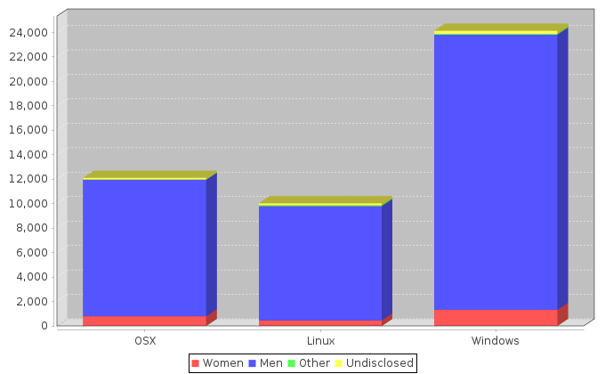
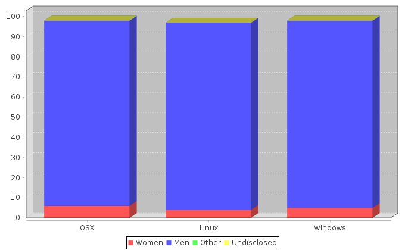

# Data for gender diversity in programming
## Based on Stack Overflow Survey data
[Original Data](http://stackoverflow.com/insights/survey)

This is just a basic analysis of Stack Overflow survey data that plots things I find interesting that Stack Overflow did not publish with their results.

## Gender

### Language Usage

The first thing I wanted to do was chart the gender distribution inside each programming language. This is just the raw headcount.


Raw Headcount is fine but I wanted to see which genders made up which portion of each language community, so here is a graph by percentage. I have to say that the headcount for languages may be fairly low so those percentages are best taken with a grain of salt.



### Operating System Usage
Here I have done the same thing with the usage of operating systems


And here are the percentages represented in a graph


## Usage

```sh
yarn
yarn build
sbt run
```


#### Editor Config

Add the following to `~/.sbt/0.13/plugins/plugins.sbt`

```scala
addSbtPlugin("org.ensime" % "sbt-ensime" % "1.12.9")
```


`sbt ensimeConfig`