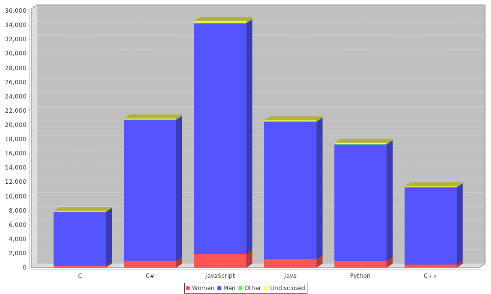
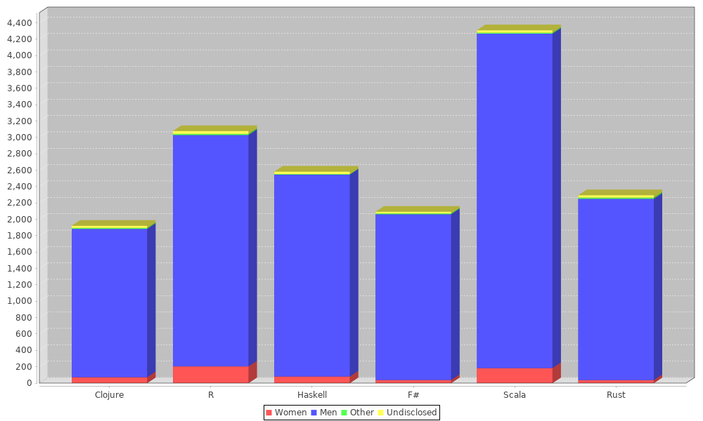
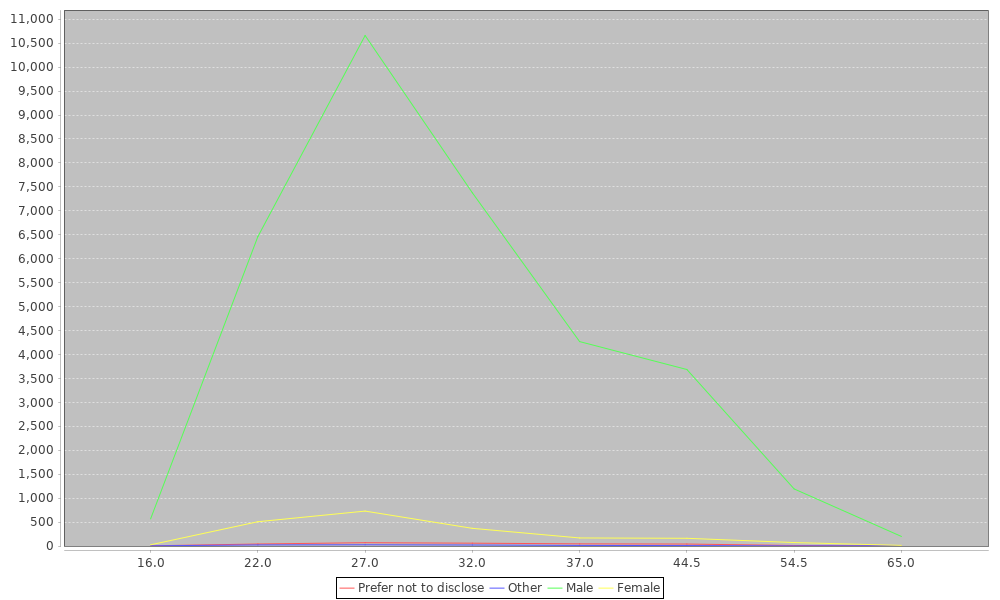

# Data for gender diversity in programming
## Based on Stack Overflow Survey data
[Original Data](http://stackoverflow.com/insights/survey)

This is just a basic analysis of Stack Overflow survey data that plots things I find interesting that Stack Overflow did not publish with their results.

## Gender

### Language Usage

The first thing I wanted to do was chart the gender distribution inside each programming language. This is just the raw headcount. I wanted to measure interest not just usage, so I have taken from both tech_want and tech_do columns for this data



Here is another showing functional languages.These sample from a much smaller pool



#### Median Ages

Line showing median ages of all survey participants




## Usage

```sh
./extract.sh
sbt run
```

The output is the set of chart pngs generated in the `./chart` directory


#### Editor Config

Add the following to `~/.sbt/0.13/plugins/plugins.sbt`

```scala
addSbtPlugin("org.ensime" % "sbt-ensime" % "1.12.9")
```


`sbt ensimeConfig`